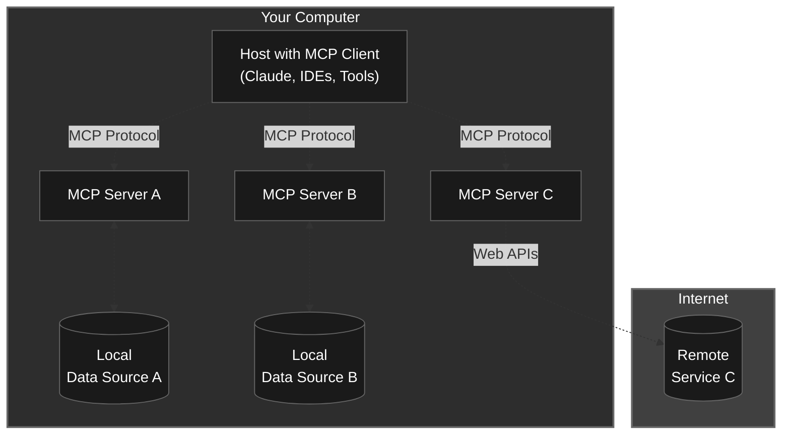
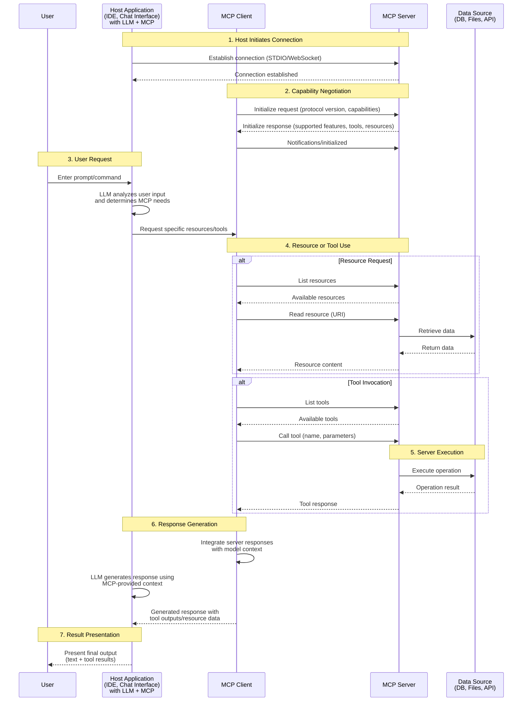
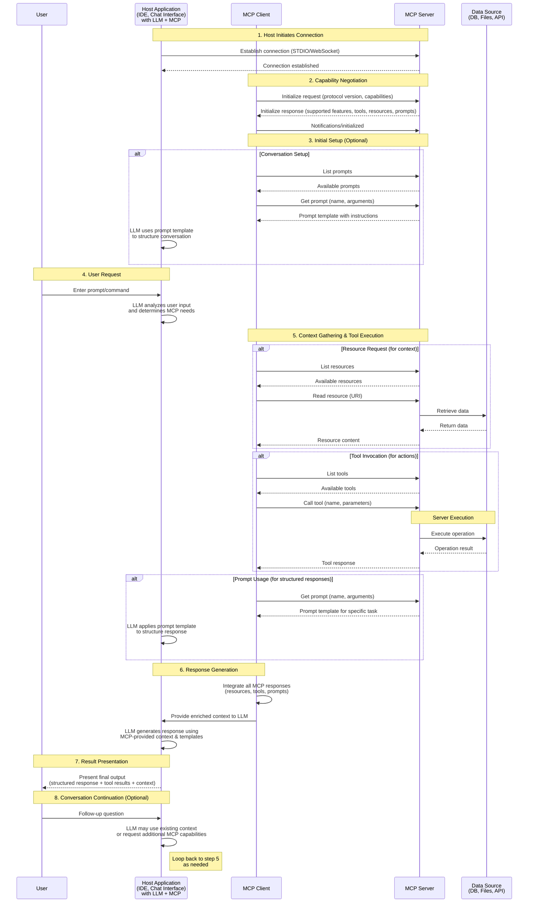

# A brief intro to MCP for developers

The Model Context Protocol (MCP) represents a fundamental shift in how AI assistants connect to external tools and data sources. Think of it as "USB-C for AI" - a universal standard that enables seamless integration between language models and the systems where your data lives. Since its launch by Anthropic in November 2024, MCP has experienced explosive growth with over 5,000 active servers and adoption by major players including OpenAI, Microsoft, and Google DeepMind.

Documentation: https://modelcontextprotocol.io/introduction
TypeScript SDK: https://github.com/modelcontextprotocol/typescript-sdk

## Core MCP architecture solves critical integration challenges

MCP addresses the fragmentation problem in AI tool integration. Before MCP, every AI assistant required custom integrations for each data source, leading to vendor lock-in and scaling difficulties. MCP standardizes this through a clean client-server architecture where lightweight servers expose capabilities via a standardized JSON-RPC 2.0 protocol.

### General Architecture


The architecture consists of three components: 
* **hosts** - applications like VS Code or Claude Desktop
* **clients** - manage 1:1 connections to servers
* **servers** - expose tools and data


### Communication Flows in MCP

#### Sequence Diagram Showing Resources & Tools:
Communication flows through initialization handshakes, capability discovery, and tool invocation cycles. The sequence diagram details the complete lifecycle of an MCP interaction, from initial connection through final response delivery. The flow demonstrates how the protocol handles three core capability types: 

* **tools** - functions LLMs can call for performing actions and computations
* **resources** - data sources LLMs can read for accessing data and context
* **prompts** - reusable templates for optimal tool usage for structuring interactions and responses

The diagram below shows how the embedded LLM acts as an intelligent translator, analyzing natural language user input to determine which MCP capabilities are needed, then integrating the responses to generate comprehensive, contextually-aware answers. This multi-step process enables AI applications to provide more accurate and useful responses by leveraging external knowledge and capabilities through a standardized protocol.



#### Expanded Sequence Diagram Showing Prompt, Tools and Resources:
While the basic sequence diagram focuses on the reactive capabilities of tools and resources, prompts introduce a proactive element to MCP interactions. Prompts serve as conversation architects, providing structured templates that guide how LLMs should approach specific tasks or format their responses. Unlike tools and resources which are typically invoked in response to user queries, prompts can be utilized at conversation initialization to establish interaction patterns, or called mid-conversation to ensure consistent formatting and approach. The extended sequence diagram below demonstrates how prompts integrate with the existing tool and resource flow, showing their unique role in both setting up conversations and structuring outputs throughout the entire interaction lifecycle.



MCP Clients can then query the server for capabilities:
```json
// Example JSON-RPC request used to request capabilities:
{
  "jsonrpc": "2.0",
  "id": 1,
  "method": "initialize",
  "params": {
    "protocolVersion": "2024-11-05",
    "capabilities": {},
    "clientInfo": {
      "name": "test-client",
      "version": "1.0.0"
    }
  }
}
```

And the MCP server will respond with something like this:
```json
{
  "result": {
    "protocolVersion": "2024-11-05",
    "capabilities": {
      "tools": { 
        "listChanged": true 
        },
      "resources": {
         "listChanged": true 
         },
      "prompts": {
         "listChanged": true 
         }
    },
    "serverInfo": { 
      "name": "hello-mcp-server", 
      "version": "1.0.0" 
      }
  },
  "jsonrpc": "2.0",
  "id": 1
}
```

The initialize response shows that your server supports tools, resources, and prompts, all with listChanged notifications enabled - meaning the server will notify clients when these lists change.

Now you can query the specific capabilities. Send the initialized notification first:

```json
{
  "jsonrpc": "2.0",
  "method": "notifications/initialized"
}
```
Once initialized, you can then request specific capabilities using methods like:

* **tools/list** - to get available tools
* **resources/list** - to get available resources
* **prompts/list** - to get available prompts

### List Available Tools:
```json
{
  "jsonrpc": "2.0",
  "id": 2,
  "method": "tools/list"
}
```

### List Available Resources:
```json
{
  "jsonrpc": "2.0",
  "id": 3,
  "method": "resources/list"
}
```

### List Available Prompts
```json
{
  "jsonrpc": "2.0",
  "id": 4,
  "method": "prompts/list"
}
```

Each of these will return the specific items your server exposes. For example, the tools/list response will show you what tools are available and their required parameters, resources/list will show available data endpoints, and prompts/list will show available prompt templates.

## Building MCP servers with TypeScript and Python

Creating an MCP server requires minimal setup. For TypeScript development, the official SDK provides a clean API:

```typescript
// TypeScript server setup
import { McpServer } from "@modelcontextprotocol/sdk/server/mcp.js";
import { StdioServerTransport } from "@modelcontextprotocol/sdk/server/stdio.js";
import { z } from "zod";

const server = new McpServer({
  name: "demo-server",
  version: "1.0.0"
});

// Define a tool with schema validation
server.tool("calculate_metrics",
  { 
    query: z.string(),
    timeRange: z.enum(["day", "week", "month"]) 
  },
  async ({ query, timeRange }) => {
    // Tool implementation
    const result = await performCalculation(query, timeRange);
    return {
      content: [{ type: "text", text: JSON.stringify(result) }]
    };
  }
);

// Add a resource for data access
server.resource(
  "config",
  "config://app/settings",
  async () => ({
    contents: [{
      uri: "config://app/settings",
      text: JSON.stringify(getAppConfig())
    }]
  })
);

// Start server
const transport = new StdioServerTransport();
await server.connect(transport);
```

Python developers can leverage the FastMCP framework for even simpler development:

```python
from fastmcp import FastMCP

mcp = FastMCP("Demo Server")

@mcp.tool()
def analyze_code(code: str, language: str = "python") -> dict:
    """Analyze code for quality metrics and suggestions"""
    metrics = perform_analysis(code, language)
    return {
        "complexity": metrics.complexity,
        "issues": metrics.issues,
        "suggestions": metrics.suggestions
    }

@mcp.resource("data://metrics/{metric_type}")
def get_metrics(metric_type: str) -> str:
    """Retrieve specific metrics data"""
    return fetch_metrics_data(metric_type)

if __name__ == "__main__":
    mcp.run()
```

You can use Anthropic's MCP Inspector tool to test your server
```bash
npx @modelcontextprotocol/inspector npx tsx server.ts    
```

## Integrating MCP servers in Cursor workflows

Cursor integration requires minimal configuration. Simply create a workspace configuration file:

Configure in VS Code:
```json
{
  "servers": {
    "demo": {
      "command": "tsx",
      "args": ["./demo-server.ts"]
    }
  }
}
```

Once configured, access MCP tools through VS Code's agent mode. The AI assistant can now directly query databases, manipulate files, interact with GitHub, and execute custom tools - all within your development workflow.

## The rich MCP ecosystem offers pre-built solutions

The MCP ecosystem has grown to include thousands of servers. **Official servers** cover common needs: filesystem operations, PostgreSQL/SQLite databases, GitHub/GitLab integration, Google Drive, Slack, and browser automation via Puppeteer. **Enterprise integrations** include Atlassian (Jira/Confluence), AWS services, Azure, Stripe, Notion, and Salesforce.

Popular **community servers** extend functionality further: Docker container management, Discord integration, YouTube data extraction, terminal control, Obsidian note management, and various database connectors. Multiple registries help discover servers: the official GitHub repository, mcp.so (700+ indexed servers), Glama (5,000+ active servers), and PulseMCP for curated collections.

Development tools have matured rapidly. The **MCP Inspector** (`npx @modelcontextprotocol/inspector`) provides essential debugging capabilities. SDKs exist for TypeScript, Python, Java, C#, Kotlin, and Ruby. Frameworks like FastMCP simplify server development across languages.

## Live coding demonstration structure
* [demos/01-hello-mcp-server/README.md](demos/01-hello-mcp-server/README.md)
* [demos/02-mcp-resource-via-tool/README.md](demos/02-mcp-resource-via-tool/README.md)
* [demos/03-mcp-prompt-via-tool/README.md](demos/02-mcp-prompt-via-tool/README.md)


## Latest developments shape MCP's future

2024-2025 brought significant updates to MCP. The March 2025 specification introduced **OAuth 2.1 authorization**, **streamable HTTP transport**, and **audio content support**. Major adoptions include OpenAI's official support across products and Google DeepMind's Gemini integration.

Best practices have emerged around **focused tool design** (goal-oriented rather than API wrappers), **scoped permissions** (multiple specialized servers), and **comprehensive error handling**. Security considerations are paramount: implement input validation, use least-privilege access, and leverage containerization for isolation.

## Debugging MCP implementations effectively

Common issues and their solutions include connection problems (verify server process and environment variables), authentication failures (check API key validity and permissions), and configuration errors (validate JSON syntax and use absolute paths).

The MCP Inspector provides comprehensive debugging:
```bash
# Debug any MCP server
npx @modelcontextprotocol/inspector python my_server.py

# Custom ports if needed
npx @modelcontextprotocol/inspector --port 5174 node server.js
```

For VS Code specifically, check server logs via Command Palette → "MCP: List Servers" → "Show Output". Enable verbose logging in development for detailed diagnostics.

## Essential resources for continued learning

Start with the official documentation at modelcontextprotocol.io and explore reference implementations at github.com/modelcontextprotocol/servers. The MCP Inspector is invaluable for testing and debugging. Community resources include multiple Discord servers, curated Awesome lists, and the upcoming "Code with Claude" conference on May 22, 2025 in San Francisco.

For hands-on learning, begin with the weather server tutorial, then progress to database integrations and custom business logic. The ecosystem provides templates for common patterns: CRUD operations, API integrations, file management, and workflow automation.

## Real-world applications demonstrate MCP's power

Enterprise adoptions showcase MCP's capabilities. 
* **Block** uses MCP for internal document access
* **Atlassian** provides deep Jira/Confluence integration
* **Apollo** enables GraphQL API management. 

Development teams use MCP for automated code reviews, documentation updates, database migrations, and CI/CD pipeline management.

A typical enterprise setup might include:
```json
{
  "servers": {
    "jira": {
      "url": "https://mcp.composio.dev/jira/company-token",
      "transport": "sse"
    },
    "postgres": {
      "command": "npx",
      "args": ["-y", "@modelcontextprotocol/server-postgres"],
      "env": {
        "DATABASE_URL": "${env:PRODUCTION_DB_URL}"
      }
    },
    "github": {
      "command": "docker",
      "args": ["run", "-i", "--rm", "ghcr.io/github/github-mcp-server"],
      "env": {
        "GITHUB_PERSONAL_ACCESS_TOKEN": "${input:github-token}",
        "GITHUB_TOOLSETS": "repos,issues,pull_requests"
      }
    }
  }
}
```

This configuration enables AI assistants to query production databases, manage Jira tickets, and automate GitHub workflows - all with proper security boundaries and audit trails.

The Model Context Protocol represents a paradigm shift in AI-assisted development. By standardizing tool integration, MCP enables developers to build powerful, context-aware AI applications that seamlessly connect to existing systems and workflows. As adoption accelerates and the ecosystem matures, MCP is positioned to become the foundational protocol for the next generation of AI-powered development tools.


